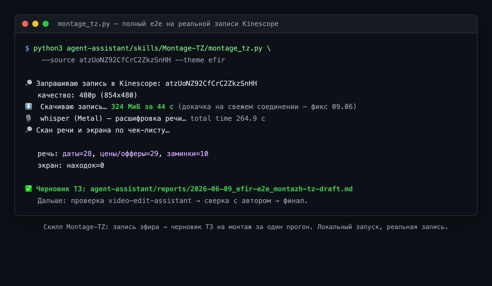
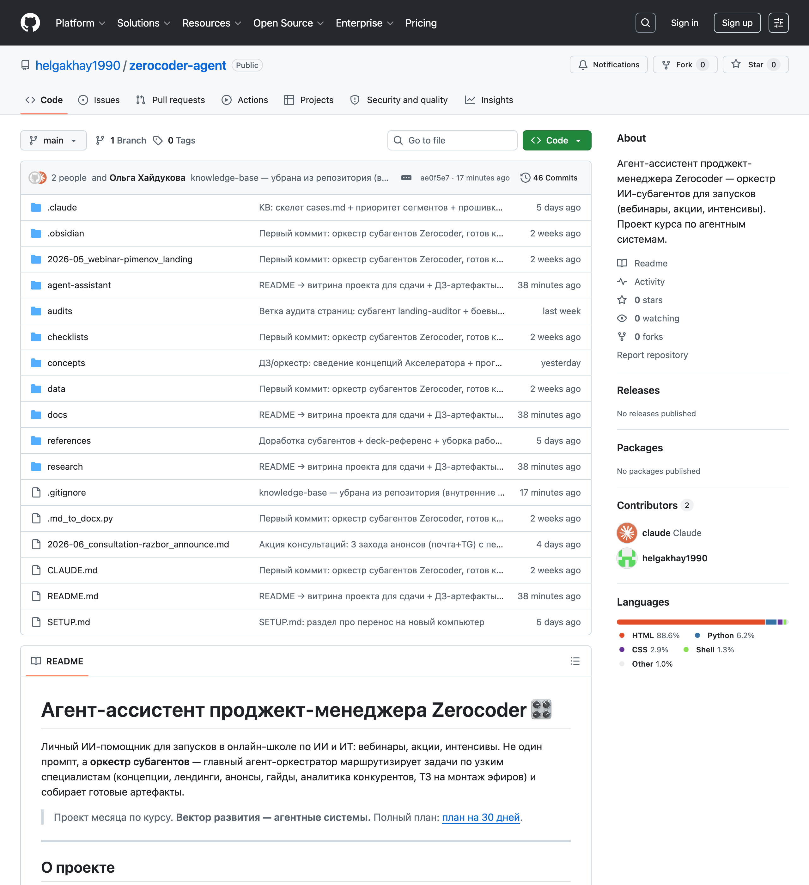
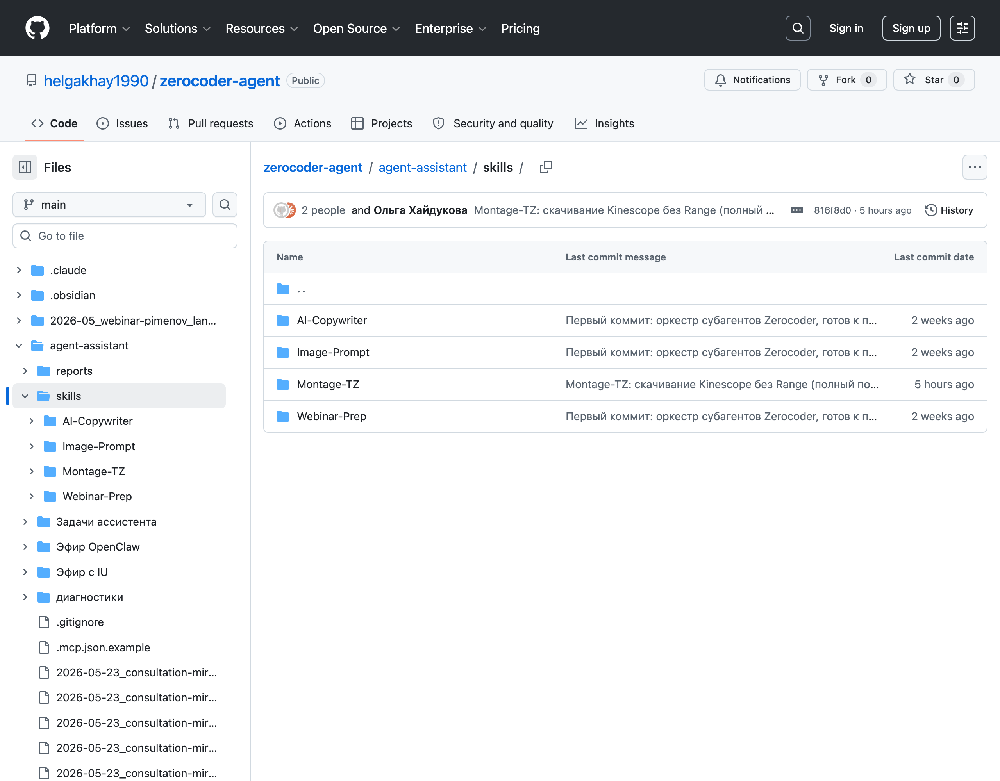
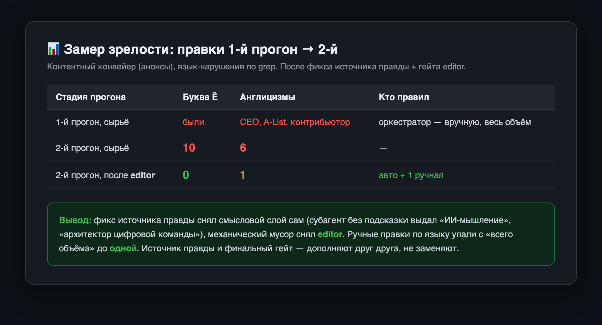
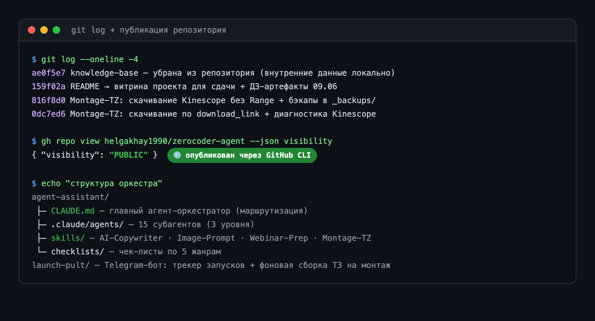

# Доказательства (скриншоты)

Скриншоты работающего проекта. Кадры со страниц GitHub сняты с публичного репозитория, терминальные — с реальных прогонов кода.

| # | Файл | Что показывает |
|---|---|---|
| 1 |  `proof-1_montage-e2e.png` | Скилл **Montage-TZ** в работе: запись эфира Kinescope → черновик ТЗ на монтаж за один прогон (скачивание 324 МиБ за 44 c, расшифровка whisper, скан речи). Реальный локальный запуск. |
| 2 |  `proof-2_github-repo.png` | Публичный репозиторий на GitHub: витрина README, список файлов, бейдж Public. |
| 3 |  `proof-3_github-skills.png` | Скиллы опубликованы в репозитории: `AI-Copywriter`, `Image-Prompt`, `Montage-TZ`, `Webinar-Prep`. |
| 4 |  `proof-4_metric.png` | Замер зрелости «правки 1-й vs 2-й прогон»: ручные правки по языку упали с «всего объёма» до одной. |
| 5 |  `proof-5_published.png` | Публикация через GitHub CLI (`visibility: PUBLIC`), история коммитов, структура оркестра. |
| 6 |  `proof-6_bot-menu.png` | Telegram-бот «Пульт оркестра»: меню с кнопками-задачами (ТЗ на монтаж · сравнить конкурентов · аудит посадки · статус) и команды. |

> Исходники терминальных карточек — в `_src/` (HTML, рендерятся в PNG через headless-браузер).
